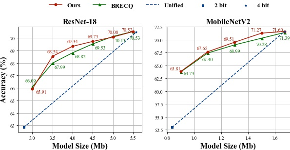

# OMPQ: Orthogonal Mixed Precision Quantization

This repository contains all the experiments of our paper "OMPQ: Orthogonal Mixed Precision Quantization". It also includes some base models and pretrain models which we list in the paper.

# Requirements

* [DALI](https://github.com/NVIDIA/DALI) (for accelerating data processing)
* [Apex](https://github.com/NVIDIA/apex) (for distributed running)
* other requirements, running requirements.txt

```python
pip install -r requirements.txt
```


# Running

To start running our code to get the optimal bit configuration, you need to download the [basemodel](https://drive.google.com/drive/folders/1q0wtmWNdqPZuZqnSCQLScYFNIYzXKebg?usp=sharing), and copy the path of base model to "--path". 

<font size=4>**Bit Configuration**</font>


```python
#!/usr/bin/env bash
python3 -m torch.distributed.launch --nproc_per_node=1 feature_extract.py \
 --model "resnet18" \
 --path "/Path/to/Base_model" \      # pretrained base model
 --dataset "imagenet" \
 --save_path '/Path/to/Dataset/' \   # Dataset path
 --beta 10.0 \                       # Hyper-parameter for bit difference
 --model_size 6.7 \                  # Target model size
 --quant_type "QAT"                  # Post-Training Quantization(PTQ) or Quantization-Aware Training(QAT)
```

or 

```python
bash ./mixed_bit/run_scripts/quant_resnet18.sh
```


<font size=4>**QAT**</font>

Because of random seed, bit configuration obtained through feature extraction may have a little difference from ours. Our bit configurations are given in bit_config.py. Our quantized models and logs are also given in [this](https://drive.google.com/drive/folders/1q0wtmWNdqPZuZqnSCQLScYFNIYzXKebg?usp=sharing) link.

```python
#!/usr/bin/env bash
python quant_train.py \
 -a resnet18 \
 --epochs 90 \
 --lr 0.0001 \
 --batch_size 128 \
 --data /Path/to/Dataset/ \
 --save_path /Path/to/Save_quant_model/ \
 --act_range_momentum=0.99 \
 --wd 1e-4 \
 --data_percentage 1 \
 --pretrained \
 --fix_BN \
 --checkpoint_iter -1 \
 --quant_scheme modelsize_6.7_a6_75B
```

or

```python
bash ./QAT/run_scripts/train_resnet18.sh
```


<font size=4>**PTQ**</font>

For the post-training quantization, we only require a few GPU hours to get the quantization model. So we set the random seed. You can directly get the same accuracy in the paper by running codes as follows:

```python
python main_imagenet.py --data_path /Path/to/Dataset/ --arch resnet18 --n_bits_w 2 --channel_wise --n_bits_a 8 --act_quant --test_before_calibration --bit_cfg "[4, 3, 3, 4, 4, 4, 4, 4, 4, 4, 3, 3, 4, 4, 3, 3, 3, 3]"
```

or

```python
bash ./PTQ/run_scripts/train_resnet18.sh
```


## Experimental Results

Table 1 and Table 2 in "OMPQ: Orthogonal Mixed Precision Quantization".

<font size=4>**QAT**</font>

| Model     | W/A     | Model Size(Mb) | BOPs(G) | Top-1(%) | Download                                                     |
| --------- | ------- | -------------- | ------- | -------- | ------------------------------------------------------------ |
| ResNet-18 | mixed/8 | 6.7            | 97      | 72.30    | [resnet18_6.7Mb_97BOPs](https://drive.google.com/drive/folders/1MmRyiYT6gULeAfS3eA_ksOFY9o_PZ6G5?usp=sharing) |
| ResNet-18 | mixed/6 | 6.7            | 75      | 72.08    | [resnet18_6.7Mb_75BOPs](https://drive.google.com/drive/folders/19aUCE3BFtqdS81ziWnepIjXXYdEBCAxi?usp=sharing) |
| ResNet-50 | mixed/5 | 16.0           | 141     | 76.20    | [resnet50_16.0Mb_141BOPs](https://drive.google.com/drive/folders/1ayexp_LXExiva4EdaQ13JTA7mJbxiYHD?usp=sharing) |
| ResNet-50 | mixed/5 | 18.7           | 156     | 76.28    | [resnet50_18.7Mb_156BOPs](https://drive.google.com/drive/folders/1BPH_hlKTR-QJzwxbnLH06UgpthQBiOrN?usp=sharing) |

<font size=4>**PTQ**</font>

| Model       | W/A     | Model Size(Mb) | Top-1(%) |
| ----------- | ------- | -------------- | -------- |
| ResNet-18   | mixed/8 | 4.5            | 69.73    |
| ResNet-18   | mixed/4 | 5.5            | 69.38    |
| ResNet-18   | mixed/8 | 4.0            | 69.34    |
| MobileNetV2 | mixed/8 | 1.3            | 69.51    |
| MobileNetV2 | mixed/8 | 1.5            | 71.27    |

 Mixed precision quantization comparisons of OMPQ and BRECQ on ResNet-18 and MobileNetV2 are as follows,

{width=65%}

## Related Works

- [BRECQ: Pushing the Limit of Post-Training Quantization by Block Reconstruction (ICLR 2021)](https://arxiv.org/abs/2102.05426)